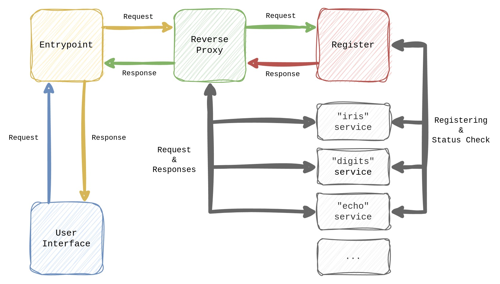

# Experimental API 

*Experimental API* (*EAPI*) is the graduation project for my Bachelor degree.

## Goals

EAPI attempts to create a easy-to-use and uniform interface to support the task of adding, removing and interacting with Machine Learning models over the Internet. 

## Architecture

In order to achieve its goals, EAPI makes use of the microservices architecture; its main components are shown in the following diagram:



It's important to note that, as of now, there's a name mismatch between some components shown in the diagram and their counter parts in the codebase; with respect to the `docker-compose.yml` config file:

- *Entrypoint* is called *backend*; its source code resides in the `be/` directory.
- *Reverse Proxy* is called *nginx gateway*; its configuration files reside in the `nginx/` directory.
- *Register* is called *consul server*;
- *User Interface* is called *frontend*; its source code resides in the `fe/` directory.

## Installation

### Github Oauth App

This system leverages GitHub for authentication; thus you need to create a GitHub Oauth App from [your account's settings](https://github.com/settings/developers). 

During the process, you will be assigned a *client ID* and a *secret key*; this data is needed for the next step.

### Environment Variables

Assuming you have just cloned the repository, you have to manually create a file `.env` to configure the basic environment variables needed to run the system; use `.env.sample` as a template.

Start by filling in `GITHUB_CLIENT_ID` and `GITHUB_CLIENT_SECRET` variables using the information obtained during the previous step.

The other variables can be left as they are or deleted altogether, since the system will use defaults.


## Run

To run the system, in the root directory run the following command

```sh
docker compose up
```

and wait for all sub-systems to start up.

The first run will take longer than the next ones, since several dependencies will need to be installed (no input required).

### Stopping

To stop the system, press `CTRL+C` inside the terminal the docker compose command was run from and wait for all subsystems to shut down gracefully.

### Clean up

To clean up run (in the root directory):

```
docker compose down
```

## Usage

Once the system is running:

- To use the UI, connect to [http://localhost:3000](http://localhost:3000) (assuming `FRONTEND_PORT=3000`).
- To use the register's UI (Consul UI), connect to [http://localhost:8500](http://localhost:8500).

## Licence

This project is currently licenced under the [MIT Licence](./LICENCE.txt).
